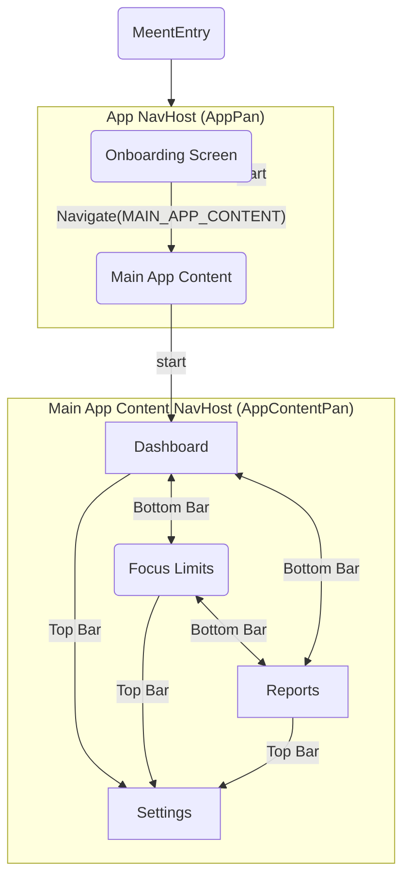

# Meent

## App Flow

```mermaid
graph TD
    Entry(MeentEntry) --> AppHost(App NavHost)
    
    subgraph AppHost ["App NavHost (AppPan)"]
        direction TB
        Onboarding(Onboarding Screen)
        Main(Main App Content)
    end
    
    AppHost -- start --> Onboarding
    Onboarding -- "Navigate(MAIN_APP_CONTENT)" --> Main
    
    subgraph MainContent ["Main App Content NavHost (AppContentPan)"]
        direction TB
        Dashboard
        Focus(Focus Limits)
        Reports
        Settings
    end
    
    Main -- start --> Dashboard
    
    Dashboard <-- Bottom Bar --> Focus
    Focus <-- Bottom Bar --> Reports
    Reports <-- Bottom Bar --> Dashboard
    
    Dashboard -- Top Bar --> Settings
    Focus -- Top Bar --> Settings
    Reports -- Top Bar --> Settings
```
