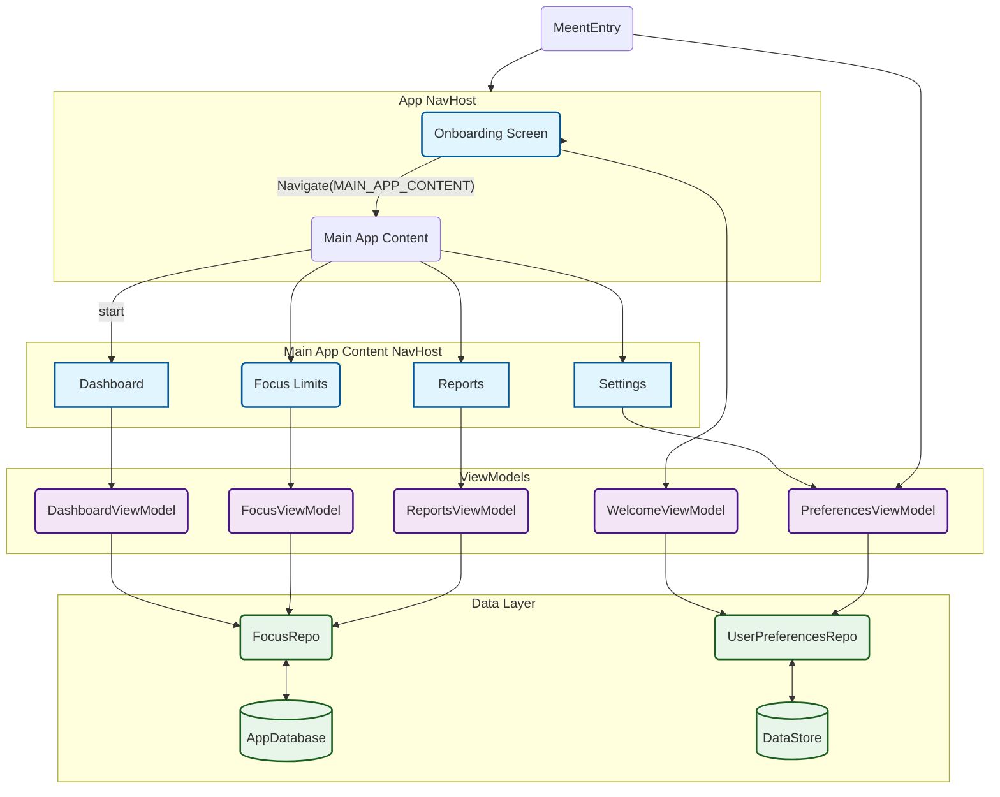

# Meent

## App Flow

```mermaid
graph TD
    Entry(MeentEntry) --> AppHost(App NavHost)
    
    %% Data Layer
    subgraph DataLayer ["Data Layer"]
        FocusRepo(FocusRepo)
        UserPrefs(UserPreferencesRepo)
        DB[(AppDatabase)]
        DS[(DataStore)]
        
        FocusRepo <--> DB
        UserPrefs <--> DS
    end

    subgraph AppHost ["App NavHost"]
        direction TB
        Onboarding(Onboarding Screen)
        Main(Main App Content)
    end
    
    AppHost ---> Onboarding
    Onboarding -- "Navigate(MAIN_APP_CONTENT)" --> Main
    
    %% ViewModels
    subgraph ViewModels ["ViewModels"]
        WelcomeVM(WelcomeViewModel)
        DashboardVM(DashboardViewModel)
        FocusVM(FocusViewModel)
        ReportsVM(ReportsViewModel)
        PrefsVM(PreferencesViewModel)
    end

    subgraph MainContent ["Main App Content NavHost"]
        direction TB
        Dashboard
        Focus(Focus Limits)
        Reports
        Settings
    end
    
    Main -- start --> Dashboard
    Main --> Focus
    Main --> Reports
    Main --> Settings

    %% ViewModel to View connections
    Onboarding --> WelcomeVM
    Dashboard --> DashboardVM
    Focus --> FocusVM
    Reports --> ReportsVM
    Settings --> PrefsVM
    Entry --> PrefsVM

    %% ViewModel to Data Layer connections
    WelcomeVM --> UserPrefs
    DashboardVM --> FocusRepo
    FocusVM --> FocusRepo
    ReportsVM --> FocusRepo
    PrefsVM --> UserPrefs

    %% Styling
    classDef screen fill:#e1f5fe,stroke:#01579b,stroke-width:2px;
    classDef vm fill:#f3e5f5,stroke:#4a148c,stroke-width:2px;
    classDef data fill:#e8f5e9,stroke:#1b5e20,stroke-width:2px;
    
    class Onboarding,Dashboard,Focus,Reports,Settings screen
    class WelcomeVM,DashboardVM,FocusVM,ReportsVM,PrefsVM vm
    class FocusRepo,UserPrefs,DB,DS data
```
